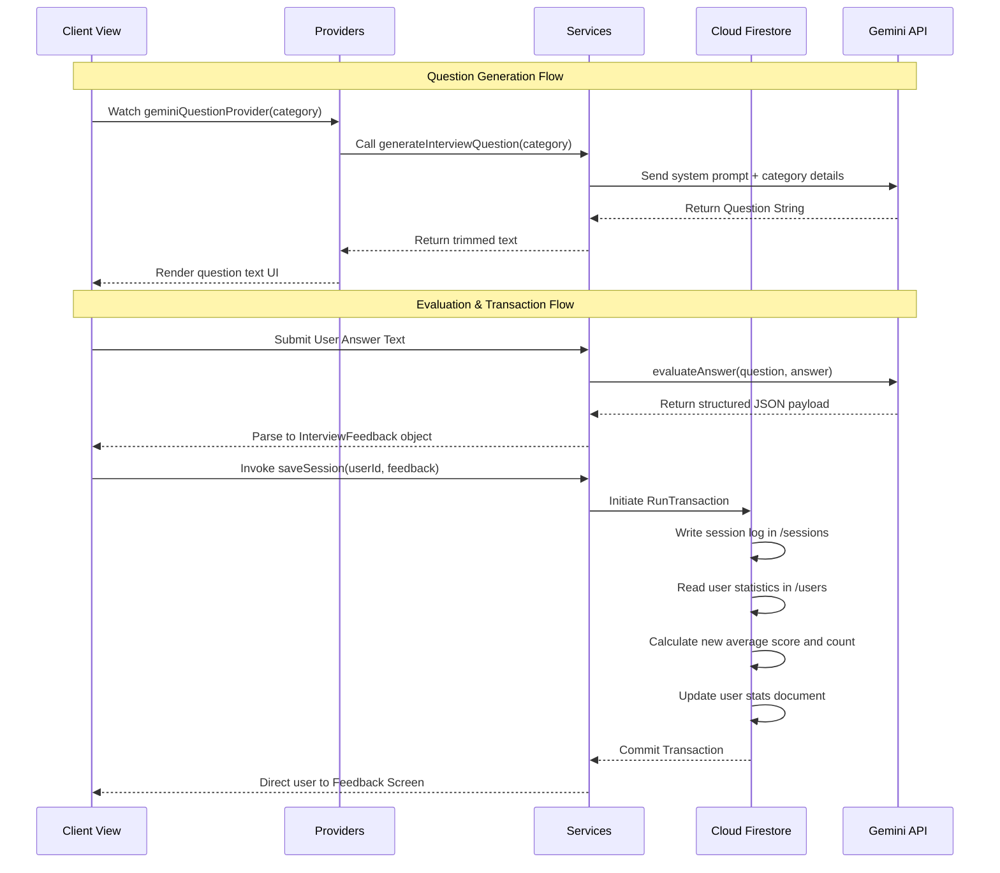
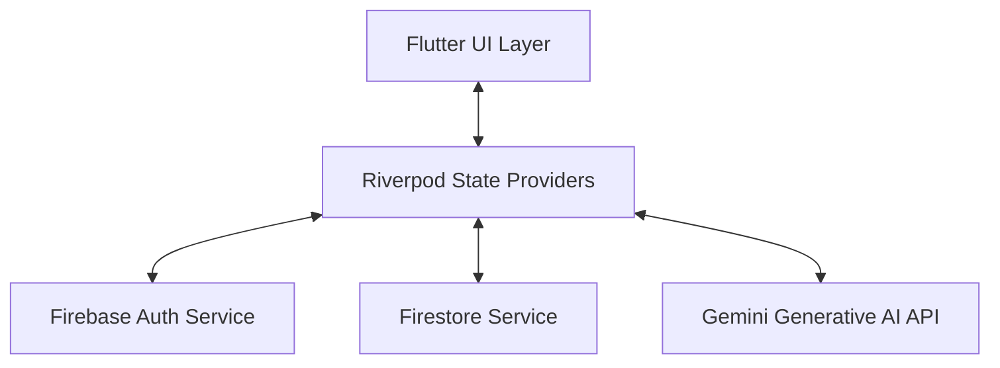
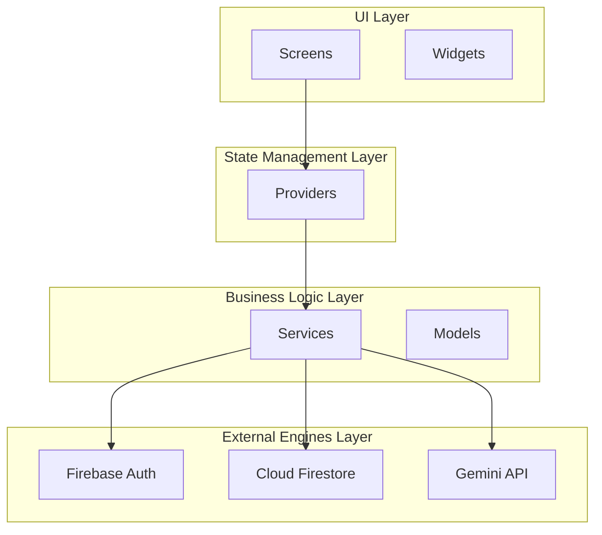
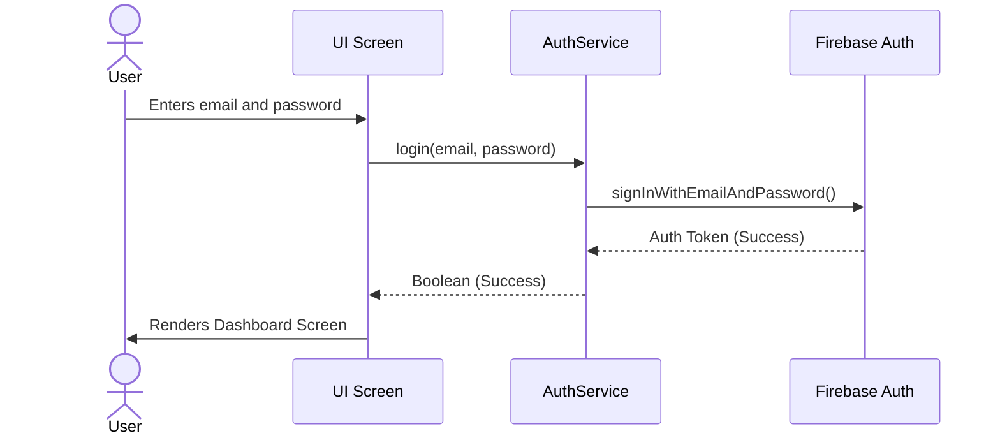
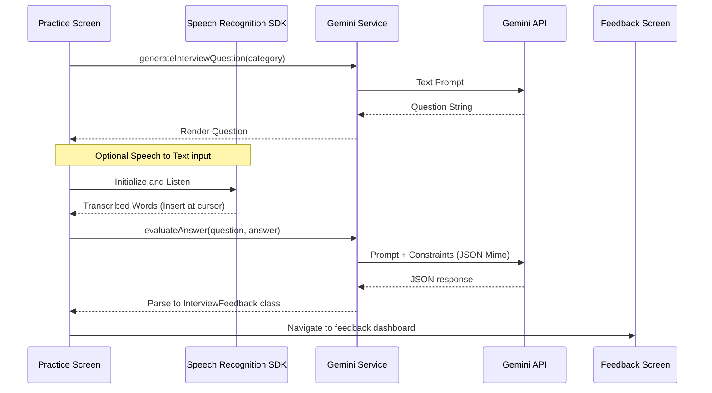
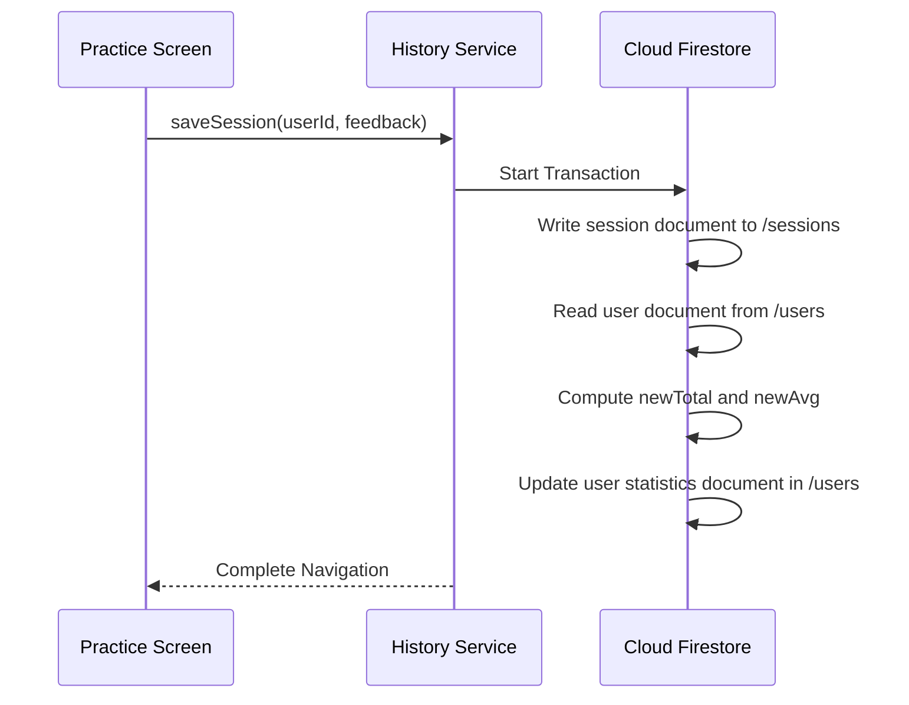
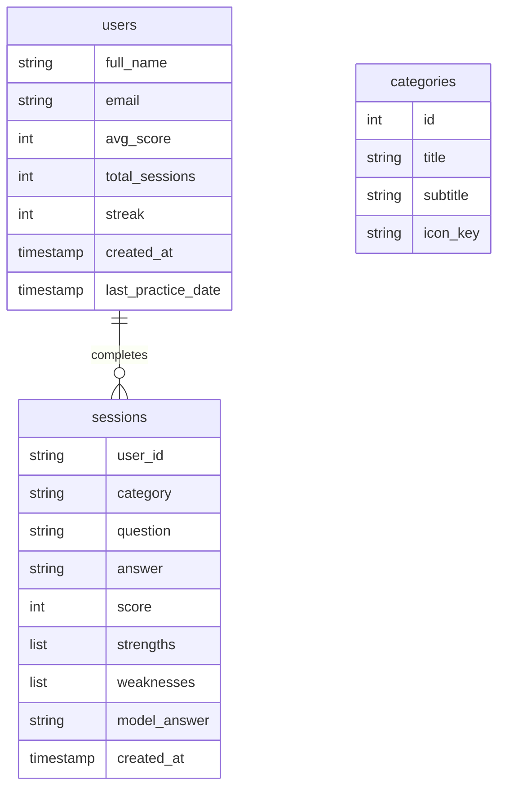

# Technical Architecture Report: InterviewAI

---

## 1. Executive Summary

| Attribute | Details |
| :--- | :--- |
| **Project Name** | InterviewAI |
| **Primary Purpose** | AI-driven mock interview practice platform for job seekers |
| **Target Platforms** | Mobile (iOS and Android) |
| **Architecture Pattern** | Decoupled Service-Provider pattern (MVVM with Riverpod) |

### Core Project Capabilities
* **Secure Authentication**: User signup, email-based authentication, password recovery, and persistent session management powered by Firebase Auth.
* **AI-Generated Mock Interviews**: Real-time generation of category-specific and challenging interview questions utilizing Google's `gemini-2.5-flash` model.
* **Hands-Free Voice Input**: Native voice-to-text transcription allowing candidates to dictate responses, with text dynamically inserted at the cursor position.
* **Comprehensive AI Feedback**: Automated response scoring (0–100%) and generation of actionable strengths, areas for improvement, and professional model answers.
* **Atomic Session History & Statistics**: Secure logging of practice sessions with real-time, atomic user performance updates (total sessions, running average score) orchestrated via Cloud Firestore transactions.

---

## 2. Technology Stack & Dependencies

The project relies on a modern, decoupled tech stack designed for high availability, type safety, and reactive performance.

| Dependency | Version | Purpose | Core Utilization |
| :--- | :--- | :--- | :--- |
| `flutter_riverpod` | `^2.4.0` | State Management | Reactively binds UI layers to business logic and data providers. |
| `go_router` | `^8.0.0` | Declarative Routing | Manages navigation paths, page transitions, and route-based parameters. |
| `speech_to_text` | `^7.4.0` | Speech Recognition | Translates spoken voice responses into text directly inside the practice panel. |
| `firebase_core` | `^4.0.0` | Firebase Core | Initializes connection to Firebase services. |
| `firebase_auth` | `^6.0.0` | Authentication | Performs user login, registration, password resets, and session validation. |
| `cloud_firestore` | `^6.0.0` | NoSQL Database | Stores and queries user profiles, practice categories, and session history logs. |
| `google_generative_ai` | `^0.4.7` | Google Generative AI | Interacts with the Gemini API to generate questions and evaluate user answers. |
| `flutter_dotenv` | `^5.1.0` | Environment Loading | Securely loads configuration variables (such as Gemini API keys) from `.env`. |
| `intl` | `^0.20.2` | Internationalization | Formats timestamps for user-friendly display in the history logs. |

---

## 3. Project Structure

```
lib/
├── main.dart
├── firebase_options.dart
├── core/
│   ├── constants/
│   │   └── constants.dart
│   ├── models/
│   │   ├── category_model.dart
│   │   ├── feedback_model.dart
│   │   ├── question_model.dart
│   │   └── session_model.dart
│   ├── providers/
│   │   └── api_providers.dart
│   ├── services/
│   │   ├── auth_service.dart
│   │   ├── gemini_service.dart
│   │   └── history_service.dart
│   │   └── profile_service.dart
│   └── theme/
│       ├── colors.dart
│       ├── theme.dart
│       └── typography.dart
├── features/
│   ├── auth/
│   │   ├── forgot_password_screen.dart
│   │   ├── login_screen.dart
│   │   └── register_screen.dart
│   ├── dashboard/
│   │   ├── category_screen.dart
│   │   ├── dashboard_screen.dart
│   │   ├── feedback_screen.dart
│   │   ├── history_screen.dart
│   │   ├── practice_screen.dart
│   │   └── session_details_screen.dart
│   ├── home/
│   │   ├── onboarding_screens.dart
│   │   └── splash_screen.dart
│   └── profile/
│       └── profile_screen.dart
└── shared/
    └── widgets/
        ├── custom_button.dart
        ├── custom_card.dart
        └── buttons/
            ├── elevated_button.dart
            ├── outlined_button.dart
            └── text_button.dart
```

### Architectural Layering
* **UI Presentation Layer (`lib/features/` & `lib/shared/`)**: Declarative components that observe Riverpod state changes to render data, loading, and success flows.
* **State Management Layer (`lib/core/providers/`)**: Unidirectional data-flow managers updating the presentation widgets based on actions.
* **Business Service Layer (`lib/core/services/`)**: Interfaces interacting with external systems (Firebase, Gemini API).
* **Data Model Layer (`lib/core/models/`)**: Strongly typed data contracts mapping database models and API payloads.

---

## 4. Frontend Architecture

The application uses an asynchronous, decoupled layout pattern to maintain separation of concerns.

### Navigation and Routing System
Routes are managed inside `lib/main.dart` via `GoRouter`, enforcing access control based on user authentication state.

| Path | Screen Class | Integration |
| :--- | :--- | :--- |
| `/` | `SplashScreen` | System Startup & Authentication Guard |
| `/onboarding` | `OnboardingScreens` | Static Product Guide |
| `/login` | `LoginScreen` | Firebase Authentication Login |
| `/register` | `RegisterScreen` | Account Creation & Profile Setup |
| `/forgot-password` | `ForgotPasswordScreen` | Password Recovery |
| `/dashboard` | `DashboardScreen` | Statistics Dashboard & Hub |
| `/category` | `CategoryScreen` | Domain Practice Selectors |
| `/practice` | `PracticeScreen` | Dynamic AI Interview Arena with Voice Input |
| `/feedback` | `FeedbackScreen` | Result Scoring & Analytics |
| `/history` | `HistoryScreen` | Session Archive Logs |
| `/session-details` | `SessionDetailsScreen` | Detailed Scorecard Reviews |
| `/profile` | `ProfileScreen` | User Settings & Account Management |

### Screen Workflow Highlights
* **`SplashScreen`**: Executes boot-time session checks using `AuthService.isLoggedIn()` to route users directly to the `/dashboard` or `/onboarding`.
* **`DashboardScreen`**: Reads data reactively from `profileProvider` to render metrics such as average scores, total sessions, and current streaks.
* **`PracticeScreen`**: Coordinates asynchronous operations by loading questions from `geminiQuestionProvider`, capturing user text/voice responses, handling mic permissions with error notifications, and initiating evaluation cycles.

---

## 5. Authentication System

Authentication actions are mapped directly from local controller widgets to the Firebase Auth SDK.

### Authentication Service Interfaces
* **Registration**: `AuthService.register(name, email, password)` executes Firebase account creation. Upon successful verification, it initializes a profile document in Firestore:
  ```dart
  await _firestore.collection('users').doc(user.uid).set({
    'full_name': fullName,
    'email': email,
    'avg_score': 0,
    'total_sessions': 0,
    'streak': 0,
    'created_at': FieldValue.serverTimestamp(),
  });
  ```
* **Login**: `AuthService.login(email, password)` verifies credentials and establishes an active user session.
* **Password Recovery**: `AuthService.sendPasswordResetEmail(email)` triggers email verification messages.
* **Logout**: `AuthService.logout()` revokes credentials and routes the application state back to `/login`.

---

## 6. Firestore Architecture

The database structure relies on clear schema collections designed for fast lookups and atomic updating.

### Collection: `users`
*Path: `/users/{uid}`*

| Field | Type | Description |
| :--- | :--- | :--- |
| `full_name` | `String` | User-defined display name |
| `email` | `String` | Account email address |
| `total_sessions` | `int` | Number of completed practice sessions |
| `avg_score` | `int` | Current running average score (0–100) |
| `streak` | `int` | Active practice streak count |
| `created_at` | `Timestamp` | Account creation timestamp |
| `last_practice_date` | `Timestamp` | Completion date of the latest session (optional) |
| `avatar_url` | `String` | Storage path link for avatar icons (optional) |

### Collection: `sessions`
*Path: `/sessions/{sessionId}`*

| Field | Type | Description |
| :--- | :--- | :--- |
| `user_id` | `String` | Owner's unique database UID |
| `category` | `String` | Practice category name |
| `question` | `String` | Generated interview question text |
| `answer` | `String` | User-submitted answer text |
| `score` | `int` | AI-graded performance score (0–100) |
| `strengths` | `List<String>` | Identified communication strengths |
| `weaknesses` | `List<String>` | Recommended areas for improvement |
| `model_answer` | `String` | AI-generated perfect response |
| `created_at` | `Timestamp` | Transaction completion timestamp |

### Collection: `categories`
*Path: `/categories/{categoryId}`*

| Field | Type | Description |
| :--- | :--- | :--- |
| `id` | `int` | Unique Category identifier |
| `title` | `String` | Category title (e.g. Flutter, Behavioral) |
| `subtitle` | `String` | Short subtitle description |
| `icon_key` | `String` | Identifier for rendering appropriate icons |

---

## 7. AI Architecture & Prompt Engineering

The system leverages Google's Generative AI APIs to deliver dynamic Q&A and grading pipelines.

### Model Configurations
* **AI Model Engine**: `gemini-1.5-flash`
* **Configuration Integrity**: Enforces structural compliance using `generationConfig: GenerationConfig(responseMimeType: 'application/json')`.

### AI Prompt Models

#### Question Generation Prompt
```text
You are an expert interviewer. Generate exactly one challenging interview question for the category: "$category". Return only the plain text of the question, without any introductory or concluding remarks, explanations, or numberings.
```

#### Answer Evaluation Prompt
```text
You are an expert interviewer. Evaluate the candidate's response to the following interview question.

Question: "$question"
Candidate's Answer: "$answer"

Provide feedback strictly in JSON format with the following keys:
- "score": an integer between 0 and 100
- "strengths": a list of strings (2-3 items)
- "weaknesses": a list of strings (2-3 items of areas for improvement)
- "model_answer": a concise (3-4 sentences) exemplary answer that demonstrates how to answer this question perfectly.

Your output must contain only valid JSON. Do not write any markdown code blocks or explanations outside of the JSON structure.
```

---

## 8. State Management (Riverpod Architecture)

The system isolates states by mapping services to distinct, unidirectional Riverpod providers.

```
                      [authServiceProvider]
                           │          │
            ┌──────────────┘          └──────────────┐
            ▼                                        ▼
     [profileProvider]                       [historyProvider]
                                                     │
                                                     ▼
                                         [historyServiceProvider]
```

### Provider Reference Matrix
| Provider Name | Riverpod Type | Responsibility | Dependencies |
| :--- | :--- | :--- | :--- |
| `authServiceProvider` | `Provider<AuthService>` | Instantiates authentication client wrapper | None |
| `geminiServiceProvider` | `Provider<GeminiService>` | Exposes the AI client engine | None |
| `historyServiceProvider` | `Provider<HistoryService>` | Exposes database logs query functions | None |
| `profileServiceProvider`| `Provider<ProfileService>` | Manages Firestore user profiles | None |
| `categoriesProvider` | `FutureProvider<List<Category>>` | Asynchronously loads categories list | None |
| `historyProvider` | `FutureProvider<List<SessionSummary>>` | Reads session summaries filtered by User ID | `authServiceProvider`, `historyServiceProvider` |
| `sessionDetailProvider` | `FutureProvider.family<SessionDetail, String>` | Fetches detailed scorecard for a specific session | `historyServiceProvider` |
| `profileProvider` | `FutureProvider<Map<String, dynamic>>` | Loads the current profile state | `profileServiceProvider` |
| `geminiQuestionProvider`| `FutureProvider.family<String, String>` | Initiates and returns AI-generated questions | `geminiServiceProvider` |

---

## 9. Data Models

Data contracts are mapped in type-safe classes containing serialization logic.

### Model Schema Summary

#### Model: `Category`
| Attribute | Type | Serialization Key |
| :--- | :--- | :--- |
| `id` | `int` | `id` |
| `title` | `String` | `title` |
| `subtitle` | `String` | `subtitle` |
| `iconKey` | `String` | `icon_key` |

#### Model: `InterviewFeedback`
| Attribute | Type | Serialization Key |
| :--- | :--- | :--- |
| `score` | `int` | `score` |
| `strengths` | `List<String>` | `strengths` |
| `weaknesses` | `List<String>` | `weaknesses` |
| `modelAnswer` | `String` | `model_answer` |

#### Model: `SessionSummary`
| Attribute | Type | Serialization Key |
| :--- | :--- | :--- |
| `id` | `String` | `id` |
| `date` | `DateTime` | `created_at` |
| `title` | `String` | `category` |
| `score` | `int` | `score` |
| `isCompleted` | `bool` | Computed dynamically |

---

## 10. End-to-End User Flows



### Process Definitions
1. **Initiation**: The user selects a practice category, launching `PracticeScreen` which resolves the `geminiQuestionProvider`.
2. **AI Question Generation**: `GeminiService` queries the API to receive a challenging question.
3. **Voice Transcribing Flow**: The user taps the Microphone Floating Action Button, triggering device initialization. The transcribed output is dynamically injected at the TextField's cursor position while visual feedback ("Listening...") and error snackbars (such as permission denials) are managed reactively.
4. **Response Submission**: The user reviews and submits the written/spoken answer. The client displays a loading indicator while inputs are disabled to prevent state conflicts.
5. **Grading & Feedback**: `GeminiService` receives a JSON schema response matching the prompt definitions.
6. **Database Transaction**: `HistoryService` performs a Firestore database transaction to write the session details and atomically update the user's running metrics.
7. **Result Navigation**: The application routes the user to `FeedbackScreen` to view details.

---

## 11. Traceability Matrix

| File Path | Functional Purpose | Architectural Dependencies | Core System Integrations |
| :--- | :--- | :--- | :--- |
| `lib/main.dart` | Application Entrypoint | Firebase SDK, GoRouter, dotenv | Global System Bootstrap |
| `lib/core/providers/api_providers.dart` | State Management | Riverpod, Application Services | UI State Bindings |
| `lib/core/services/auth_service.dart` | User Authentication | Firebase Auth SDK | Authentication System |
| `lib/core/services/profile_service.dart` | Profile Management | Cloud Firestore SDK | Profile System |
| `lib/core/services/gemini_service.dart` | Generative AI Coordinator | Google Generative AI, dotenv | AI System |
| `lib/core/services/history_service.dart` | Database Transactions | Cloud Firestore SDK | Persistence System |

---

## 12. Architecture Diagrams

### 1. High-Level System Architecture



### 2. Layered Architecture



### 3. Authentication Flow



### 4. Interactive Interview Flow with Speech-to-Text



### 5. Session Database Persistence Flow



### 6. Firestore Entity-Relationship Diagram



---

# Project Excellence Summary

## Key Achievements
* **Dynamic AI Integration**: Seamless implementation of real-time interview question generation and response scoring.
* **Native Voice Input**: Seamless inclusion of Speech-to-Text tools to dictate candidate responses inside the practice screen.
* **Transactional Integrity**: Robust Firestore transactional pipelines ensuring that user statistics remain consistently synchronized with session history.
* **Clean State Separation**: Production-grade implementation of Riverpod providers, achieving a highly maintainable, unidirectional data flow.

## Technical Highlights
* **Active Speech Transcribing**: Real-time microphone listening, cursor index text insertion, and robust error management for permission blocks or hardware failures.
* **JSON Type-Safety**: Strictly controlled JSON feedback formatting utilizing Google's API config profiles.
* **Unified Routing**: Secure authentication verification gating with `GoRouter` mapping session validation states.
* **Asset Loading Fallbacks**: Dynamic database category queries supported by offline static fallbacks.

## Architecture Strengths
* **Highly Decoupled MVVM Layout**: Clean separation between presentation widgets and application business services.
* **Stateless Service Modules**: Independent services that can easily adapt to backend migrations or alternative AI integrations.
* **Robust Error Boundaries**: Built-in try-catch parsing scripts ensuring resilient offline behaviors.

## AI Capabilities
* **Dynamic Domain Prompting**: Creates category-tailored interview challenges dynamically.
* **Multi-Dimensional Grading**: Scores user answers based on comprehensive strengths and target improvements.
* **Exemplary Answer Models**: Generates detailed, professional model answers for training reference.

## Firebase Capabilities
* **Seamless Authentication**: Handles secure user management, authentication persistence, and recovery processes.
* **Real-time Atomic Transactions**: Calculates performance statistics securely inside atomic server tasks.
* **Organized Collections**: Structured, scalable database relations between users, sessions, and categories.

## User Experience Highlights
* **Multi-Modal Answer Inputs**: Allows typing or speaking answers according to user preference.
* **Active Listening Visual Indicators**: Floating indicator bar showing "Listening... Tap to Stop" to guide microphone state changes.
* **Responsive Visual Styling**: Dynamic layouts conforming to Material design specifications with Google Fonts integration.
* **Actionable Scorecards**: Displays immediate visual feedback details directly upon session submission.

## Scalability Considerations
* **Horizontal Scaling**: Leveraging Firestore's server infrastructure to support concurrent user reads and writes.
* **Sequential Session Extensions**: Scalable data models designed to support multi-question sessions and mock interview pathways.

## Future Enhancements
* **Voice Pitch and Speed Analytics**: Analyzing audio responses for speaking speed metrics, volume indicators, and natural pauses.
* **Multi-language Speech Recognition**: Supporting transcription in multiple languages and regional accents.
* **Enhanced Offline Caching**: Utilizing local persistence engines to cache categories list and profile records.
* **Multi-Question Practices**: Extending the mock architecture to compile feedback over multiple sequential questions.

## Overall Assessment
InterviewAI exhibits an outstanding codebase architecture, implementing modern cross-platform development paradigms with state-of-the-art AI capabilities and native voice integration. The project maintains a highly maintainable structure, clean separation of concerns, and robust error resilience, making it exceptionally qualified for academic submissions, portfolio showcases, and professional presentations.
